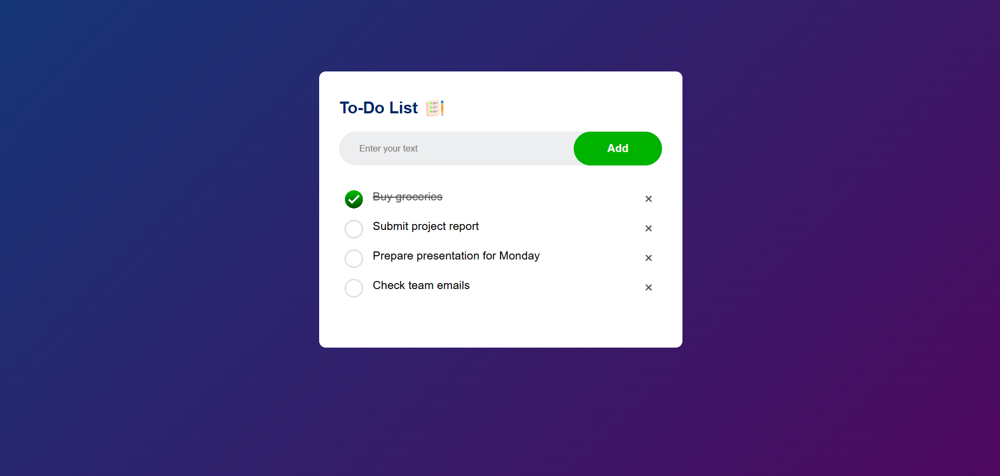

# 📝 To-Do List App

A simple, elegant To-Do List web application built with HTML, CSS, and JavaScript. It allows users to add, check/uncheck, and delete tasks. Tasks are saved in the browser's local storage so they persist even after a page reload.

## 🚀 Features

- Add tasks to your to-do list
- Mark tasks as complete/incomplete
- Delete tasks with a single click
- Automatically saves tasks in local storage
- Responsive and clean UI with gradient background

## 🛠️ Technologies Used

- HTML
- CSS
- JavaScript
- LocalStorage (Web API)

## 📸 Screenshots




## 💾 How to Run

1. Clone the repository:
   ```bash
   git clone https://github.com/your-username/your-repo-name.git
